## Note*: This is sample code only. Please contact at gowithexpert@gmail.com for original code

## Main Screens:

## Patient Section: Footer Page

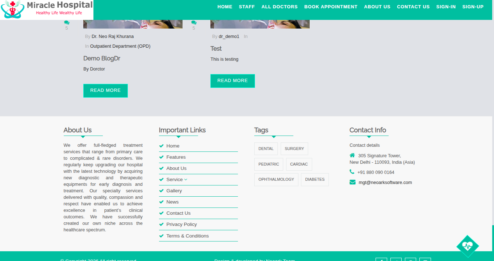

## Patient Section: All Dcotors

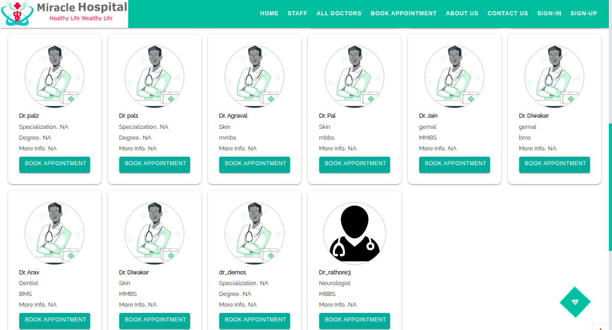

## Staff Home Page
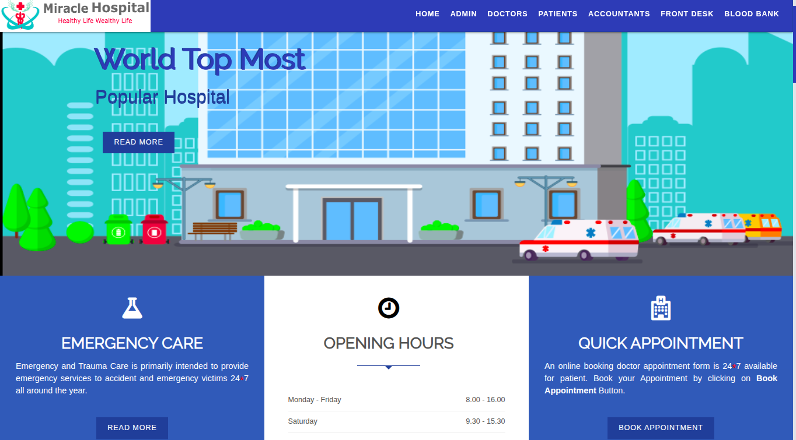

## Patient Feedback Page
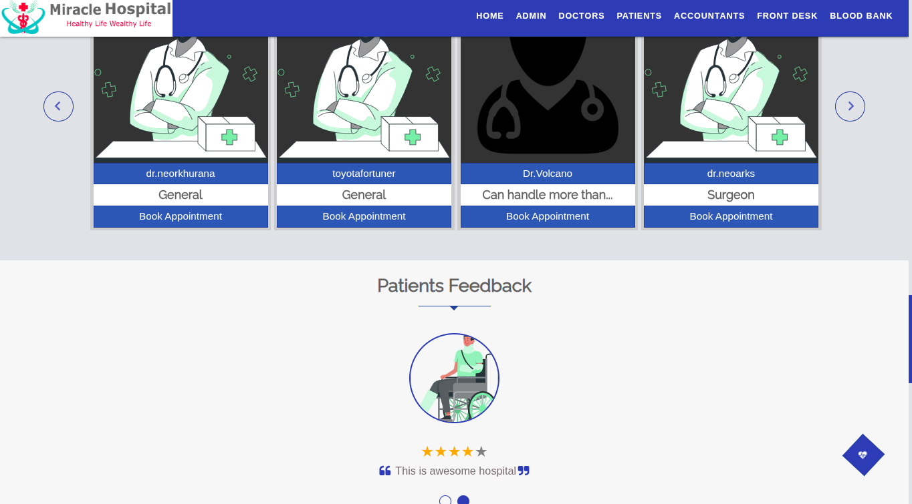

## Doctor Login Page
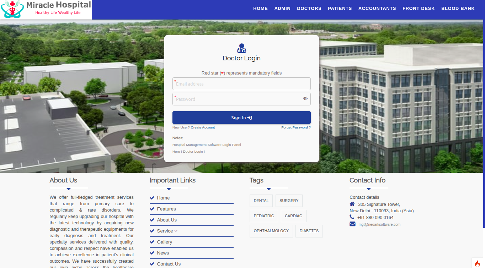

## Doctor Dashboard
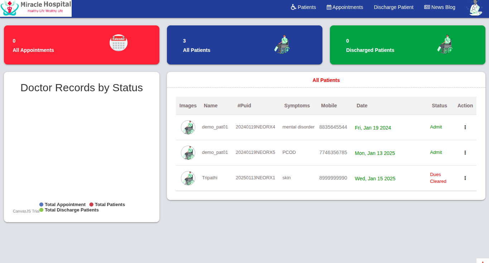

## Doctor Patient Page
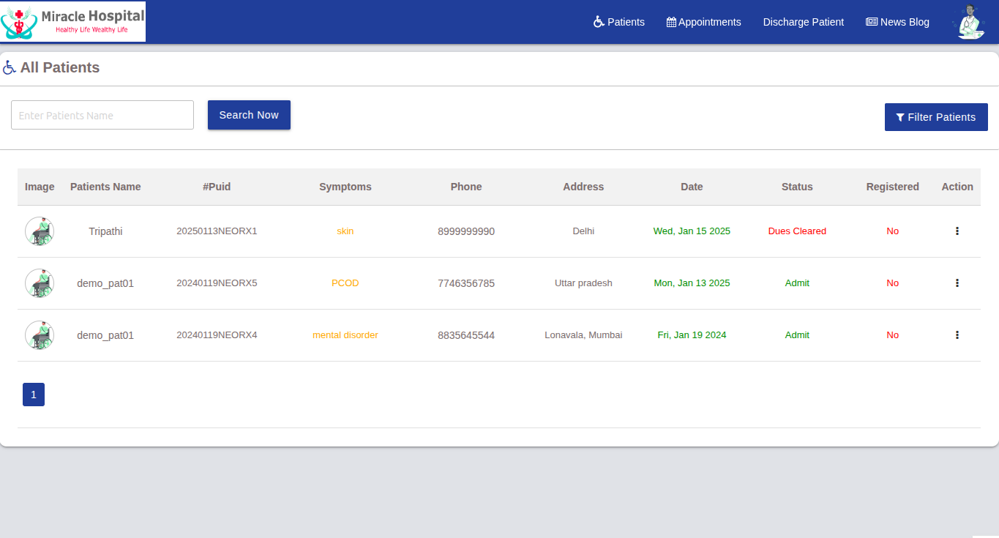

## Admin Login Page
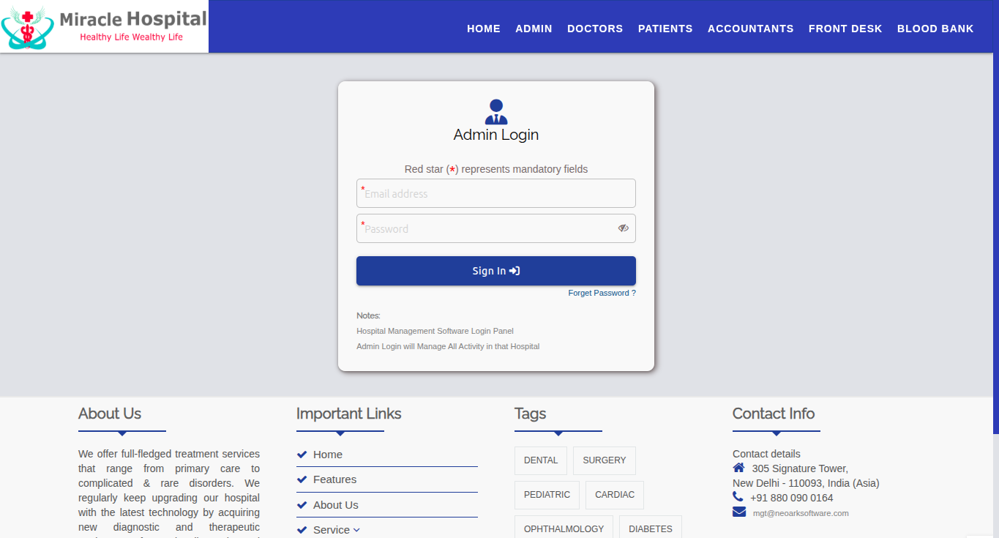

## Admin Dashboard
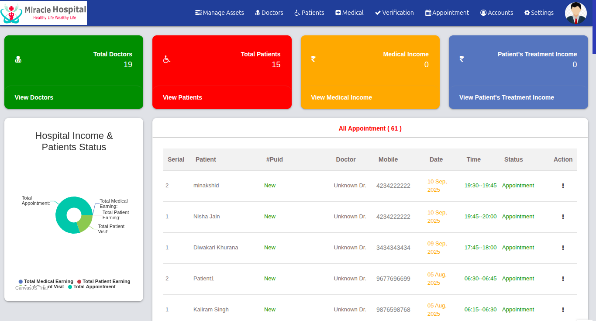

## Admin Assets Manage Options
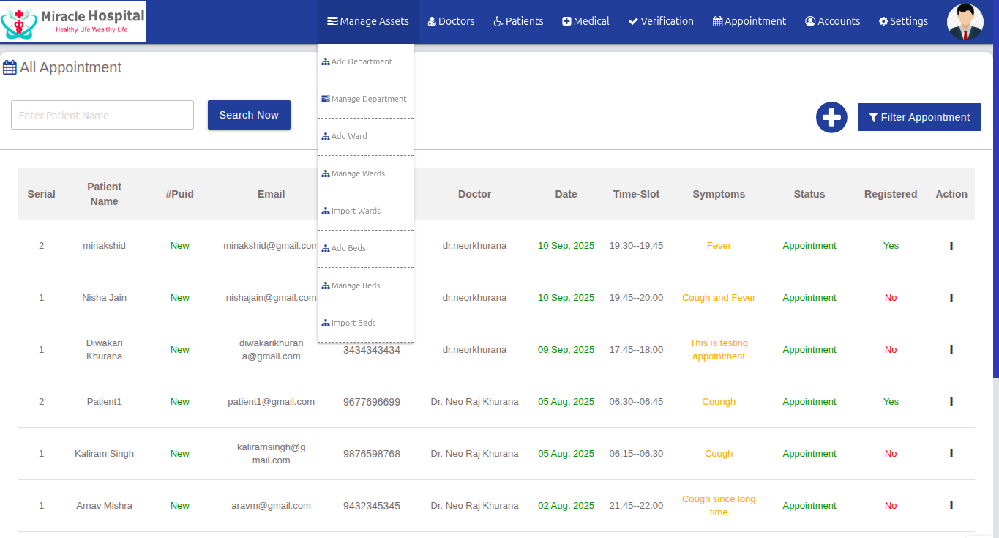

## Admin Medical Options
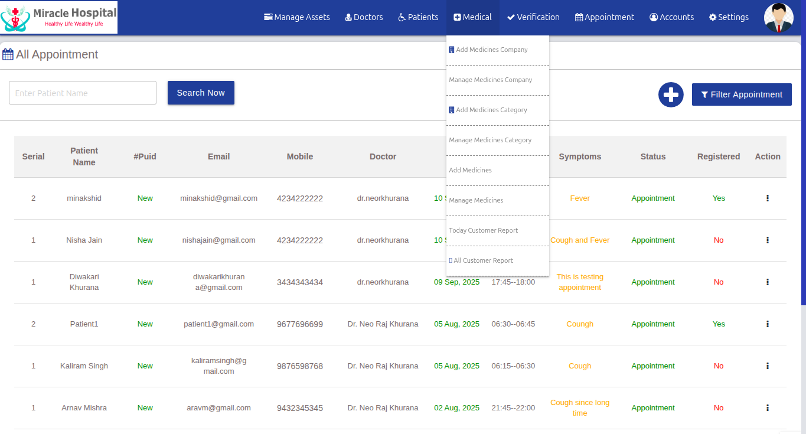

## Admin Appointment Options

## Admin Accounts Options
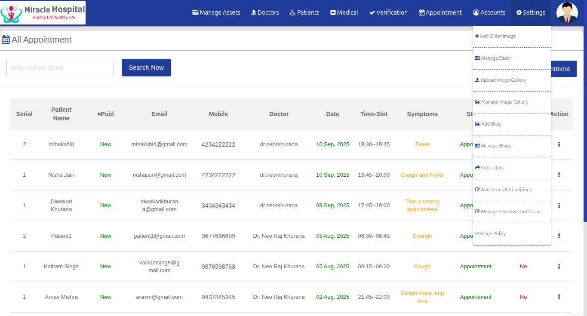

Project Deployent Steps: 
========================
1. cd /var/www/html
2. git clone git URL
3. git checkout required branch 
4. Check .gitignore and put the .gitignore files & directories from backup etc
5. 

Project Objectve: Trainings for Installation & cofiguration codeigniter version-4.2.10
================

Trancate Talble: 
booked_doctor_appointment
patients
revisit_patients
login_activity
patients_login
patient_discharge

Refrences: 
=========
1. Download: https://codeigniter.com/download
2. Tutorial: https://codeigniter4.github.io/userguide/tutorial/news_section.html

Codeigniter (version 4.3.3) Installation Steps on Ubuntu (22.04 LTS):
=======================================================================
1. Download [recommended latest version]: https://codeigniter.com/download 
2. Alt+Ctl+T                                                          [Open Terminal]
3. sudo cd ~/Downloads                                                [Go to Downloads]
4. sudo mv codeigniter4-framework-v4.3.3-0-ge3821f9.zip /var/www/html/   [Moved downloaded codeigniter into documentRoot path]
5. cd /var/www/html                                                   [Go to documentRoot path ]
6. sudo unzip codeigniter4-framework-v4.3.3-0-ge3821f9.zip           [Unzip codeigniter]
7. sudo mv codeigniter4-framework-v4.3.3-0-ge3821f9 miracle_hospitals    [Renamed TO codeigniterv4 (my project name)]
8. cd /var/www/html/miracle_hospitals                                     [Go to my project directory]

Settings & Confurations:
=======================
1. sudo cp env TO .env                                      [Rename env to .env] 
2. sudo gedit .env                                          [Open .env file]
a. Comment CI_ENVIRONMENT = production & add CI_ENVIRONMENT = development
b. app.baseURL = 'http://localhost:8080/miracle_hospitals/public/'
c. sudo gedit /app/Config/App.php                         [Open App.php file]
d. public $baseURL = 'http://localhost:8080/miracle_hospitals/public/';   [Set $baseURL ]
e. sudo mkdir /var/www/html/miraclehospitals_test/writable/cache

3. Permissions:
a. sudo chmod 777 -R writeable/cache
b. sudo chmod 777 -R writeable/debugbar
c. sudo chmod 777 -R writeable/logs
d. sudo chmod 777 -R writeable/session
e. sudo chmod 777 -R writeable/uploads

Database Settins:
=================
1. sudo gedit app/Config/Database.php           [Open database file & enter database credentials]
2. <pre>public $default = [                          [Set database - hostname, username, password ]
        'DSN'      => '',
        'hostname' => 'localhost',
        'username' => '',
        'password' => '',
        'database' => '',
        'DBDriver' => 'MySQLi',
        'DBPrefix' => '',
        'pConnect' => false,
        'DBDebug'  => (ENVIRONMENT !== 'production'),
        'charset'  => 'utf8',
        'DBCollat' => 'utf8_general_ci',
        'swapPre'  => '',
        'encrypt'  => false,
        'compress' => false,
        'strictOn' => false,
        'failover' => [],IA5ISDvF2ZQBJljp
        'port'     => 3306,
    ];
</pre>

3. Permissions:
==============
sudo chown neoarks:neoarks -R /var/www/html/miracle_hospitals/
sudo chown www-data:www-data -R /var/www/html/miracle_hospitals/public
sudo chown www-data:www-data -R /var/www/html/miracle_hospitals/writable/
 

 4. Defined Custome Constats: Change below defined constants 
 ============================
  sudo gedit app/Config/Constants.php
  define('ADMIN_EMAIL', 'terminalstack@gmail.com');
  define('DEV_AUTHOR', 'Neoarks');
  define('ISU_SUPPORT', 'Please contact admin for support ');

5. Routing Settings:
================
  1. app/Config/Routes.php
    $routes->setAutoRoute(false);

2. app/Config/Feature.php
  $autoRoutesImproved = true;
// The Auto Routing (Legacy) is very dangerous. It is easy to create vulnerable apps
// where controller filters or CSRF protection are bypassed.
// If you don't want to define all routes, please use the Auto Routing (Improved).
// Set `$autoRoutesImproved` to true in `app/Config/Feature.php` and set the following to true.
// $routes->setAutoRoute(false);

6. Run Project/Spark
====================
  1. php spark serve                      [Run server and show browser url likewise: http://localhost:8080 OR http://localhost:8081]
  2. http://localhost:8080 OR             [Run at browser (note: port will be shown by php spark serve command)]
   http://localhost/codeigniterv4/public/

1. Credentials: 
Dr. credentials: 
Login name: demodoc44@gmail.com 
Password: demodoc44

Login name: newdoclogin@gmail.com 
Password: newdoclogin

7. Optional Settings:
==================== 
I. Default Defined constants: Just for using wherever needed
  1. FCPATH /var/www/html/miracle_hospital/public PATH
  2. WRITEPATH /var/www/html/miracle_hospital/writable PATH

II. .htaccess Settings 
  1. Changed 
    Options All -Indexes 
    To
    Options -Indexes
    
